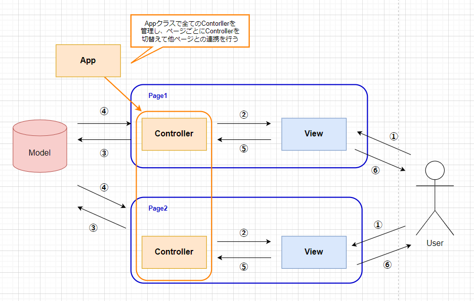

# 1. Flet_MVCテンプレート設計書
 pythonを使用したネイティブアプリの開発を効率的に行えるように作成するテンプレートの設計書です。 
 Webフレームワークでよく使われるMVCアーキテクチャを採用しました。

## 1.1. 要件
 - Fletを利用したMVCテンプレートを作成すること。
 - 画面は「Page1」と「Page2」の2つを用意する。
 - 出来る限り、あらゆる実装方法が統一化できる構成にする。

## 1.2. MVCについて
 システム開発においての設計方針の一つで「Model」　「View」　「Controller」の3つに分けてコードを管理する構成です。 
 

## 1.3. 基本的な構成
MVCではクラス同士の関係を疎結合にし、それぞれの独立した形を保つ必要があります。今回、UI生成についてはコントローラクラスでビュークラスをインスタンス化して行う構成になっています。Fletにはページ遷移の為のメソッドを設定するメソッドがあり、そこでページ生成を行うコントローラを切り替える実装を行っています。

**コントローラとビューの独立性を保つためにしたこと**
- ページの生成方法
     コントローラのメソッドでビュークラスのインスタンスを生成して、UI生成を行います。
- コントローラの抽象クラスを作成
     ページ生成などの共通メソッドを必ず実装するためにBaseControllerクラスを作成します。
- ページ遷移の実現方法
     すべてのコントローラをAppクラスでまとめて管理し、そこからページ表示メソッドを呼び出せるよう作成します。
     ※コントローラを辞書型リストで保持し、キーを指定して簡単に呼び出す事ができます。

**今回のテンプレートで使用する主なクラスの種類** 
※クラス名の語尾に群がついているものは複数定義される可能性があるものです。
| No | クラス名 | 説明 | 備考 |
| ---- | ---- | ---- | ---- |
| 1 | Viewクラス群 | UI生成を担当。 |　 |
| 2 | Controllerクラス群 | 担当するビューのイベントメソッドの定義を行う。主にModelとViewの橋渡しを行う。 |　担当するViewとセットで作成する。
| 3 | Modelクラス群 | データの保持を担当。 |
| 4 | App | アプリの初期化(各クラスの連携)とコントローラの管理。 | ページ遷移などの共通処理をこのクラスを経由し、コントローラを切替えて呼び出す。| 

　シングルトンパターンのように主要クラス(View,Controller,Modelなど)はAppクラスのコンストラクタで各クラスのインスタンスを１つだけ生成し、共有して連携を行います。
  　※Viewは対となるControllerクラスでインスタンス化してUI生成を行います。